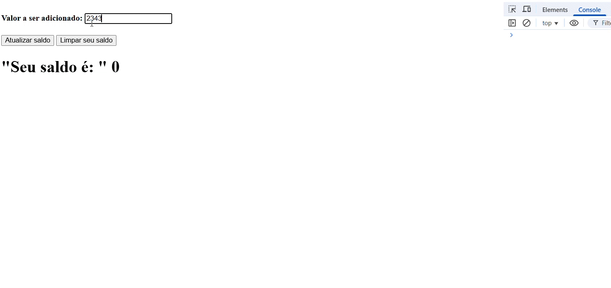

# Balance Management App Project

This repository contains a simple web application for managing a financial balance. Users can add amounts to the balance and reset it to zero when necessary.

## Description

The project uses HTML for the interface, with an input field for adding values to the balance, two buttons for updating and clearing the balance, and a display where the current balance is shown.

## Features

- **Add to Balance**: Adds the value specified by the user to the total balance.
- **Clear Balance**: Resets the total balance to zero.

## Project Structure

The code is organized into two main files:

- **app.js**: Contains the original logic of the application, written in JavaScript.
- **app.ts**: A corrected and improved version of app.js, written in TypeScript to enhance the security and maintainability of the code.

- ## 📸 Example

